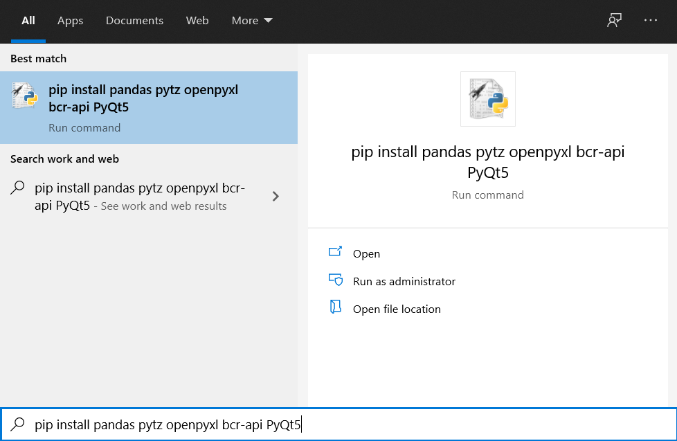

# Brandwatch
## Installation
Use the package manager [pip](https://pip.pypa.io/en/stable/) to install necessary packages. 
```bash
pip install pandas pytz openpyxl bcr-api PyQt5
```


## Usage
### With GUI
- Double click `BrandwatchGUI.py` to open as python application. 
- Input token or username and password to login, it will skip if you already login or ask for login if token is expired.
- Select a project from project list, click button 'Get Groups' to fetch group list.
- Select groups from the list, it can be one or multiple groups, click button 'Get Queries' to fetch query list.
- Select queries from the list, it can be one or multiple queries.
- You can click predefinited period, or you can set customize time range in the input area, Brandwatch will use UTC time by default, if you want to select a period with NZT, you can click radio button to make it convert to UTC in the background.
- Click button 'Fetch Data' to fetch the raw data from Brandwatch, and available attributes will be shown in orderby dropdown menu.
- You can choose orderby and order direction after the data is fetched, and a save path with file name you want need to be set before you click button 'Download'. You can click the button next to path input area to select folder or open destination folder. 


# Twitter API merge
## Installation
Use the package manager [pip](https://pip.pypa.io/en/stable/) to install necessary packages. 
```bash
pip install pandas twarc emoji requests
```

## Usage
- Set credentials into .env file, the format should be
```
[credentials]
consumer_key = xxxxx
consumer_secret = xxxxx
access_token = xxxxx
access_token_secret = xxxxx
```
- Use command line with `python3 twitter.py <path>/brandwatch.csv <path>/twitter.csv [True|False]`, Replace <path> with the relative/absolute file path, \'brandwatch.csv\' is the file generated from brandwatch-downloader, \'twitter.csv\' is the output file, there is an optional parameter True or False for hash userid, default is True.
- Please note, csv file is using \',\' as delimiter.
Example:
```
python3 twitter.py /home/brandwatch.csv /home/twitter.csv
```
or
```
python3 twitter.py /home/brandwatch.csv /home/twitter.csv False
```

# Facebook data
## Usage
- Use command line with `python3 fb.py <path>/brandwatch.csv <path>/fb.csv [True|False]`, Replace <path> with the relative/absolute file path, \'brandwatch.csv\' is the file generated from brandwatch-downloader, \'fb.csv\' is the output file, there is an optional parameter True or False for hash userid, default is True.
- Please note, csv file is using \',\' as delimiter.
Example:
```
python3 fb.py /home/fb.csv /home/fb.csv
```
or
```
python3 fb.py /home/fb.csv /home/fb.csv False
```

## Todo
- Hashing user details
- Duplication removal
- Other data processing
- Unit test
- Deploy brandwatch.py into Pypi, then BrandwatchGUI.py can run independently

## Contributing
Pull requests are welcome. For major changes, please open an issue first to discuss what you would like to change.

Please make sure to update tests as appropriate.

## License
[GNU General Public License v2.0](https://choosealicense.com/licenses/gpl-2.0/)